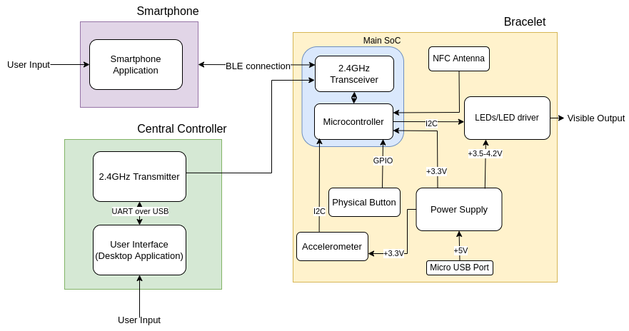
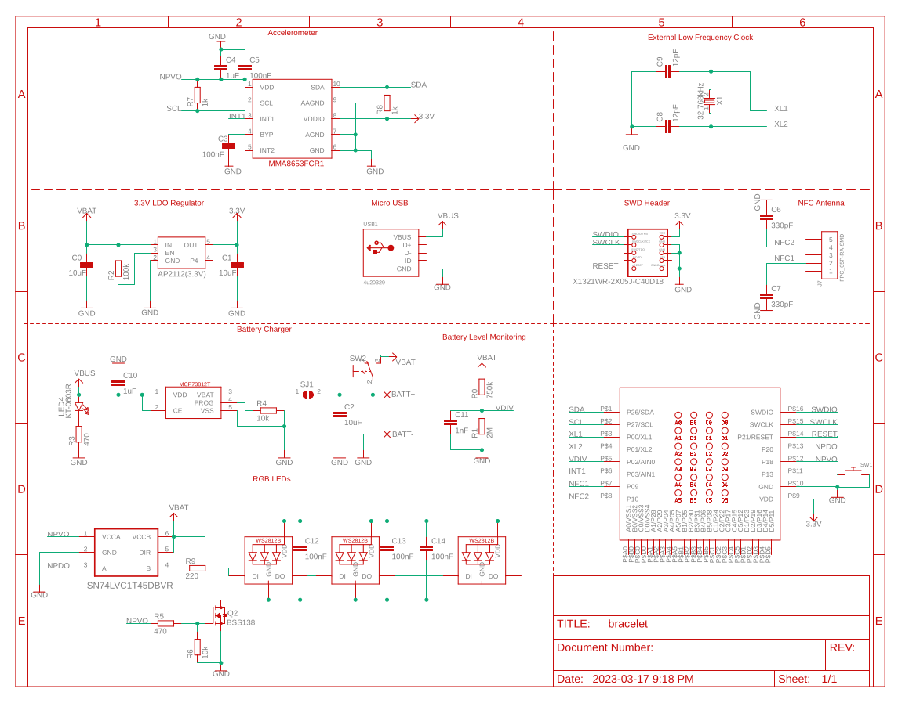
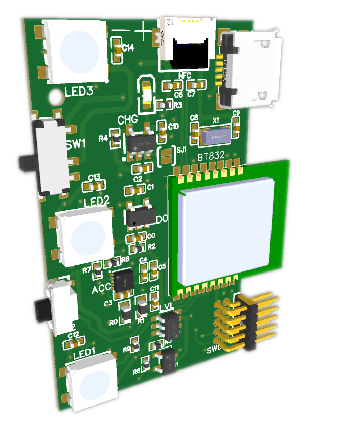
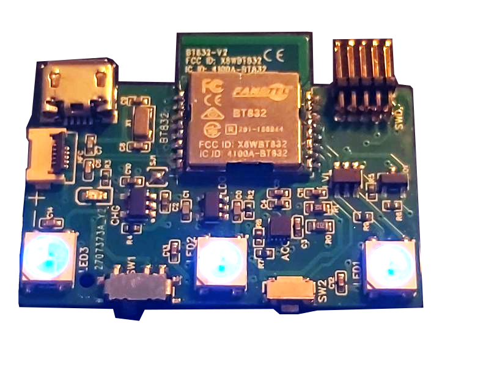
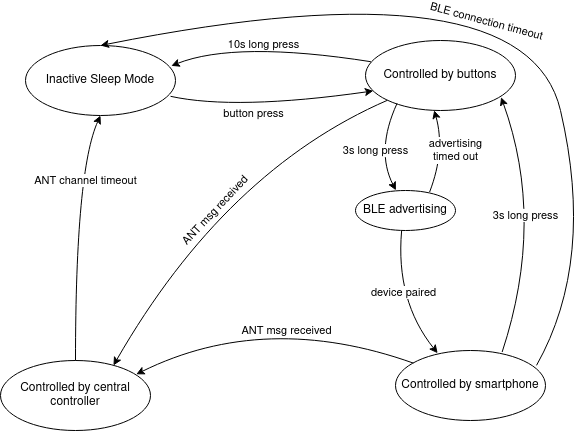
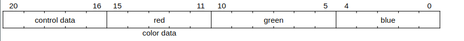

# Wireless LED Bracelet
###### *My part of a 4th year capstone design project. See media/Design_Presentation.pptx for more details*

## Concept
Rechargeable LED bracelet that can be controlled in three different ways:
1. Wirelessly by a venue to create lighting shows during events. 
2. Wirelessly through a smartphone app for use outside of a concert venue.
3. By physical buttons on the bracelet and onboard accelerometer.

## Design

#### Block Diagram

- Uses an nRF52832 SoC.
- BLE is used for connection to smartphones.
- Packets from central controller are received over another 2.4GHz protocol simultaneously.
- Onboard accelerometer enables motion based control.
- NFC integration allows for additional use cases.

#### Prototype Schematic

### Demos

#### Smartphone

#### Accelerometer

#### Button

#### Central Controller

#### Assembled PCB

# System Design

## Summary

A block diagram for the 2.4GHz RF solution is shown in Figure 5. In the block diagram the system is separated by the three physical items, the central controller, the bracelet, and a smartphone, each of these items have subsystems within. In this design, a 2.4GHz SoC is used to connect to a smartphone over BLE as well as receive messages from a central controller over ANT. The SoC also acts as the main processor for the device, reading input from the button and an onboard accelerometer, and controlling the LED drivers. On the connected smartphone there is an app that is capable of configuring the LEDs on the bracelet. The central controller has a desktop application which connects over USB to a 2.4GHz SoC that acts as the transmitter to forward messages using ANT to all the bracelets. Bracelets can be assigned groups using NFC.

_Figure 5. System design block diagram_

## Functionality

There are three independent sources of control for the bracelet:

1. Controlled by the physical buttons
2. Controlled by the smartphone
3. Controlled by the central controller over ANT

While not in any of the active control modes, the SoC will be in a low power sleep mode, LEDs will be off, and the radio will be disabled. A state diagram including the transitions between the three control modes and sleep mode is shown in figure 6. A detailed description of each mode and the transitions between modes follows.

_Figure 6. State diagram for control of LEDs on bracelet_

Inactive sleep mode

On powerup the device will be in sleep mode, a press on the bracelet’s button will wake the device from sleep. Once the device is awake it will initially be in the _controlled by buttons_ state.

Controlled by buttons

While in this state, the button can be pressed to cycle through some basic predefined LED patterns (solid colour, flashing etc.). A 3 second long press on the button will trigger the bracelet to start _BLE advertising_. If the button is pressed and held for 10 seconds, the device will turn off its LEDs, and return back to _inactive sleep mode_. While in the button control mode the SoC will also periodically search for messages from a central controller. If messages are being received over ANT that means the bracelet is at a live event and it will transition to being controlled by the central controller.

BLE advertising

While in the _BLE advertising _state_ _the bracelets LEDs will flash blue to indicate that the device is attempting to connect to a smartphone. The bracelet can be paired from the smartphone app as described in the Smartphone Application section. As the bracelet does not have a display capable of showing digits efficiently, and the data being passed over the BLE link is not sensitive we will be using “Just Works” pairing which requires no passkey entry. To mitigate the chance of connecting to the wrong bracelet in a concert setting, the BLE advertising name will be printed on the bracelet and there will be an option to pair using NFC instead. If the BLE advertising times out without pairing to a device, the SoC will transition back into the controlled by button mode, BLE advertising can be attempted again with another 3 second long button press.

Controlled by smartphone

Once paired to a smartphone over BLE, the bracelet's LED lights will be controlled solely by the connected smartphone. However, a long press on the button will forcibly disable the BLE connection and return LED control to the button. If the BLE connection is dropped and reconnection times out, the bracelet will go back into sleep mode. While connected over BLE and in smartphone control mode, the SoC will periodically search for messages from a central controller. If messages are received over ANT, it means the bracelet is at a live event and will be controlled by the central controller.

Controlled by central controller

When searching for a specific ANT device, all channel parameters including device ID, frequency, and channel period are preset and the device continuously listens on the specified frequency. Once a message from the correct ID is found, the ANT channel will synchronise to that message, scheduling its next receive window according to the pre-defined channel period and automatically adjust its timing based on the time of the next received packet. This is the extent of the ANT “connection”. Since the bracelets are acting as receivers only, an unlimited number of bracelets can theoretically track and listen in to the central controllers transmissions. Having bracelets as receive only enables us to have an asymmetrical setup where the central controller is transmitting at a much higher power than the bracelets and also saves us the trouble of managing individual connections with a large number of bracelets.

While receiving messages from the central controller over ANT, the SoC will be controlling its LEDs based on the data being received. If the device drops the ANT connection it will attempt to search and reconnect to the central controller for 5 minutes. If the ANT search times out then the bracelet will transition back into sleep mode.

# Detailed Design

The main Bracelet SoC must be capable of:

* BLE connection to a smartphone
* Receiving ANT packets from the central controller
* Receiving an assigned group over NFC
* Reading input from the physical button on the device
* Reading accelerometer data from the onboard accelerometer via I2C
* Driving the 3 onboard LEDs based on physical input, accelerometer data, and the wireless connections

When selecting a SoC there were multiple devices available that met some of the above requirements, however the best option was the nRF52832 by Nordic Semiconductor. The nRF52832 has a combined protocol stack for using BLE alongside ANT, it also has built-in NFC and supports I2C. The ultra low cost cousin of the nRF52832, the nRF52810, was also considered but its lack of NFC and I2C support made it not worth the cost savings.

A BT832 module by Fanstel which is a packaged nRF52832 with RF circuitry and PCB antenna will be used to limit the development cost of RF circuit design and wireless certification. This module is FCC certified and is a recommended third party module by Nordic Semiconductor. The nRF52832 SoC will be using the S312 SoftDevice, which is Nordic’s ANT and BLE combined protocol stack. The specifics of radio scheduling to manage running a BLE connection and ANT in coexistence is abstracted away by the SoftDevice API. The protocol stack is capable of up to four BLE connections in the peripheral role, and up to 15 individual ANT channels concurrently.

In order to monitor the onboard battery level, the battery will be connected to a voltage divider circuit that gets sampled by the nRF52832’s ADC. When the measured battery voltage passes below a certain level, the bracelet will go into sleep mode. On wake, the bracelet checks the battery voltage, if it is still below the required threshold it briefly indicates via the LEDs that it is out of battery and then returns to sleep mode.

In order to assign a group to a bracelet, a bracelet can be written to using NFC by the smartphone application. By using NFC scanning we can avoid having to pair over Bluetooth to assign a bracelet to a group. Using NFC enables the use case where event attendees have their bracelets scanned at the gate when entering a venue in order to assign a group based on the location of their seats. The nRF52832 has built-in support for NFC. While in sleep or button control mode the NFC reader is configured to interrupt and record the received signal. When a message is written over NFC, the bracelet will update its assigned group accordingly.	

Any of the three control modes can also set the bracelet into a mode that changes LED colours based on motion. To enable this we have an onboard accelerometer that interfaces with the nRF52832 over I2C. The main SoC will sample data from the accelerometer, and trigger lighting effects when a threshold acceleration value is reached.

## Central Controller Transmitter

The purpose of the central controller transmitter is to forward messages from the desktop application to all the bracelets using ANT. The device receives messages from the desktop app over a USB connection. The device is also powered via the USB connection. The hardware of the central controller prototype consists of a nRF52832 SoC, along with an nRF21540 RF front-end module. The front end module is required so that we can achieve the range necessary for our application. All scheduling of lighting effects is being done on the desktop application itself, and the transmitter is only responsible for forwarding the data to the groups via 2.4GHz radio.

The transmitter will be using the ANT wireless protocol in a broadcast topology. ANT is an isochronous protocol, transmitting data at regular periods on a fixed frequency. ANT usage and configuration is channel-based, each ANT node can connect to other nodes via dedicated channels. These channels are automatically timeslotted by the ANT protocol stack. The configuration of a channel includes its type, the frequency that the channel will be transmitted at, the period in between messages, and some identifying data. For our application, the central controller will be using multiple master transmit-only channels, and each bracelet will have one slave receive-only channel.

### Packet Format

As stated in _Requirement 2.9_, the central controller must be able to control up to 32 individual groups of bracelets at a refresh rate of 10Hz. In order to accomplish full colour effects, each packet contains a 16-bit colour value per group. The bracelet also needs to receive some control data with each packet which is used for transitions between colours, preset patterns, and enabling motion detection modes. The control data was originally estimated to be 16 bits, but further elaboration on the design determined that was overkill. By decreasing the allocated control data to 5 bits we are able to fit three groups in each standard 8 byte payload ANT packet. Each group needs a 21-bit message at a rate of at least 10Hz.

_Figure 7. ANT data message_

The ANT protocol stack on the nRF52832 supports up to 15 ANT channels at once. When a bracelet is assigned a group, it reads from a preset table to determine which ANT channel ID it will be listening for, as well as which group within a packet it is assigned to. With this format, a bracelet only has to track a single ANT channel. 

To achieve the required refresh rate and latency the transmitter will be broadcasting at the maximum allowable rate. The maximum ANT channel rate for a single channel running on an nRF52832 is 200Hz. We will need 11 total channels (32 groups/3 groups per channel) to accommodate all of our groups. This means that the frequency per channel is approximately 18Hz (200Hz/11 = ~18Hz), which gives us a considerable margin over the 10Hz required refresh rate. Therefore, the central controller will configure 11 ANT channels all with a rate of approximately 18Hz.

### Operation

After being configured, an ANT channel will broadcast periodically and will schedule its timeslots between the other channels running on the device. Once that data for an ANT channel is set it will continue to broadcast that payload indefinitely until the data is updated. Our software on the nRF52832 will configure its 11 channels with the predefined channel IDs and then listen for serial messages from the desktop app. The messages from the desktop application will include the 21 bits of data in the same format as is sent to the bracelets and a group identifier. On reception of a message, the firmware running on the nRF52832 will find the correct channel and data offset for the group identifier provided and update its payload contents. Since our transmitter device is running off of USB power, we are fine with sending redundant messages and will continue transmitting the same data unless it is explicitly updated. Sending redundant messages will also serve to reduce the penalty of a missed packet. If a bracelet misses a packet and is still stuck in a previous state, it may be able to pick up the next packet and synchronise back with the rest of the bracelets within our 100ms latency requirement.

Since only one channel can be transmitted at a time, this means that if the desktop application sends serial messages to update all groups at once, the actual messages sent to each bracelet will be offset from one another. Assuming there are 11 18Hz-channels, the most that one channel can be offset from another is 1s/18Hz = ~55ms. A 55ms offset is still within our 100ms latency requirement, and we do not expect it to be noticeable to the human eye.

The typical range of an ANT module (such as the nRF5282) is around 30 metres under ideal conditions, but can be increased through use of an external amplifier. According to Nordic Semiconductor “the nRF21540 RF FEM’s +20 dBm TX output power and 13 dB RX gain ensure a superior link budget for between 16 and 20 dB improvement. This equates to a 6.3 to 10 times theoretical range improvement.”. Considering ANT’s typical range of 30m with Nordic Semiconductor’s range extension estimation, the range of our ANT broadcasts should be extended to ~189-300m, well beyond our required distance.